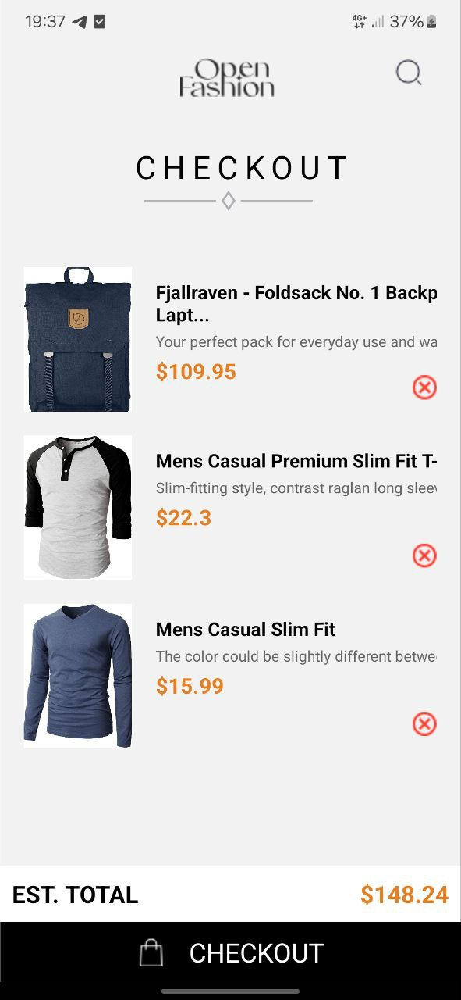
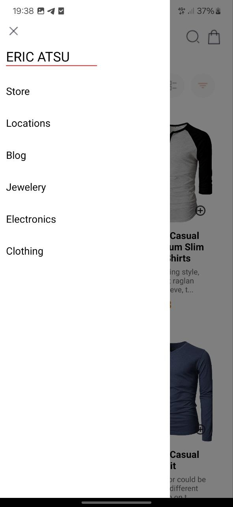
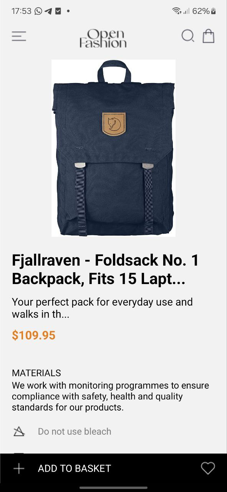

# 11173490

## Project Overview

This project is a React Native application that allows users to view a list of products, view detailed information about each product, add products to their cart, and remove products from their cart. It uses an external API to fetch product data and manages the cart state locally using `AsyncStorage`. The app includes a navigation drawer for easy access to different screens.

## Components and Functionality

### 1. HomeScreen

- **Purpose**: Displays a list of available products fetched from an external API.
- **Features**:
  - Fetches product data from an API (`https://fakestoreapi.com/products`).
  - Displays product items in a grid using `FlatList`.
  - Each product has an "Add to Cart" button.

### 2. ItemDetailScreen

- **Purpose**: Displays detailed information about a selected product.
- **Features**:
  - Shows a larger view of the product image.
  - Displays the product title, description, and price.
  - Provides an option to add the product to the cart.

### 3. CartScreen

- **Purpose**: Displays products that have been added to the cart.
- **Features**:
  - Shows a list of selected items in the cart.
  - Each item has a "Remove from Cart" button.
  - Calculates and displays the total amount for the items in the cart.

### 4. Navigation

- **Drawer Navigation**: Accessible through a swipe gesture or a button. Provides navigation between HomeScreen, ProductDetailScreen, and CartScreen.

## Technical Details

### Fetching Data

- **API**: Products are fetched from the API endpoint `https://fakestoreapi.com/products`.
- **Method**: Data is fetched using the `fetch` API. The data is processed and formatted before being used in the app.

### Local Storage

- **Storage Solution**: `AsyncStorage` is used to store and retrieve cart items locally on the device.
- **Functions**:
  - `addToCheckout(item)`: Adds an item to the cart and saves it in `AsyncStorage`.
  - `removeFromCheckout(item)`: Removes an item from the cart and updates `AsyncStorage`.
  - `loadCheckout()`: Loads the cart items from `AsyncStorage` on app initialization.

### Asynchronous Operations

- **Handling Asynchronous Data**: Used `async/await` for fetching data from the API and managing local storage operations.

## Code Structure

- **`components/`**: Contains reusable components such as `Collection`, `Footer`, and `CheckoutHeader`.
- **`utils/`**: Contains utility files for API fetching (`fetchapi.js`) and cart management (`asyncstorage.js`).
- **`screens/`**: Contains the main screens of the application:
  - `HomeScreen.js`
  - `ProductDetailScreen.js`
  - `CartScreen.js`
- **`App.js`**: Main application file that sets up navigation and context providers.

## Screenshot

